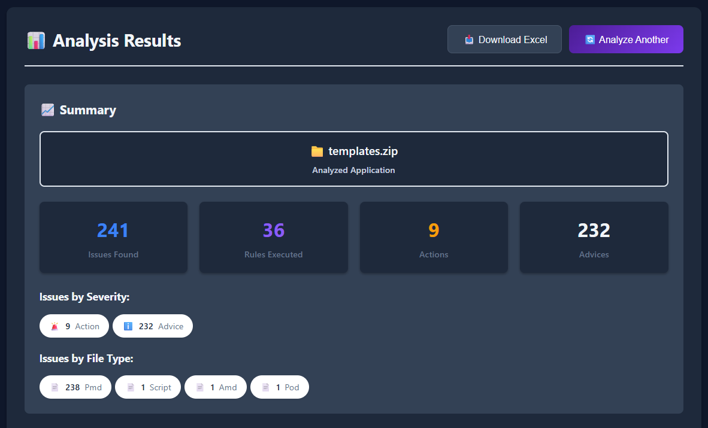
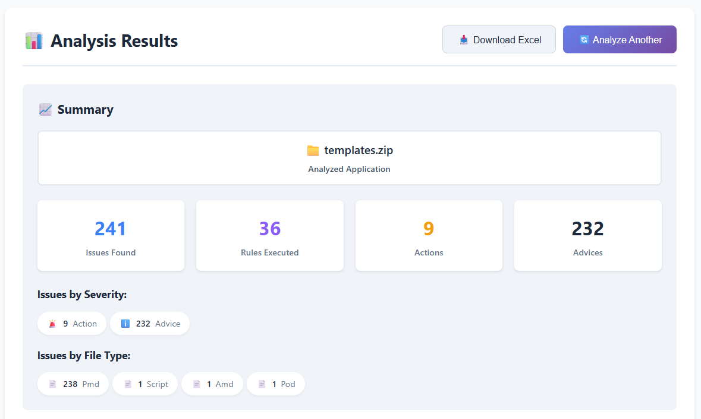
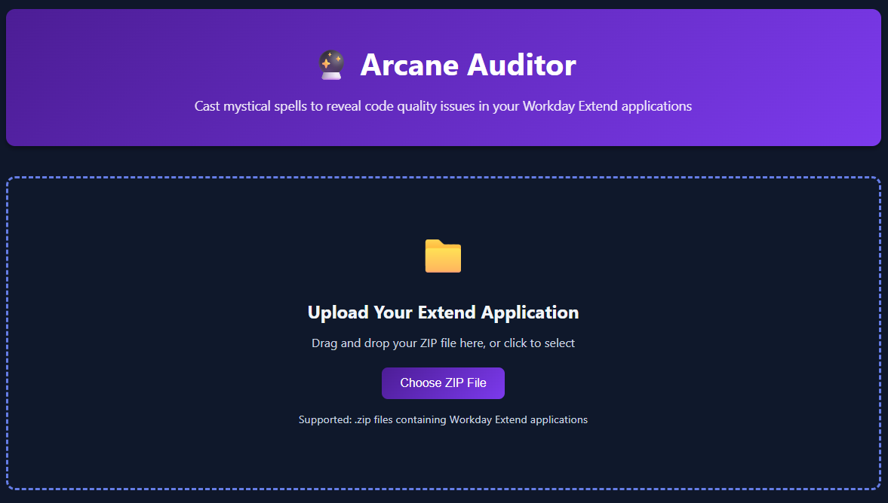
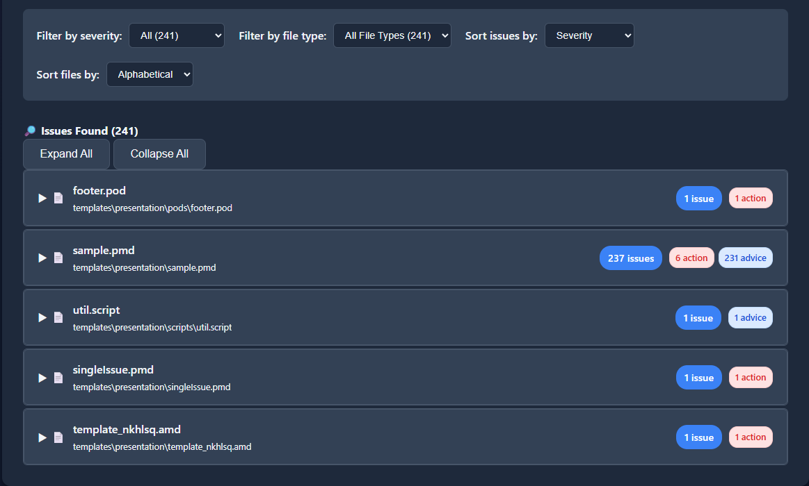
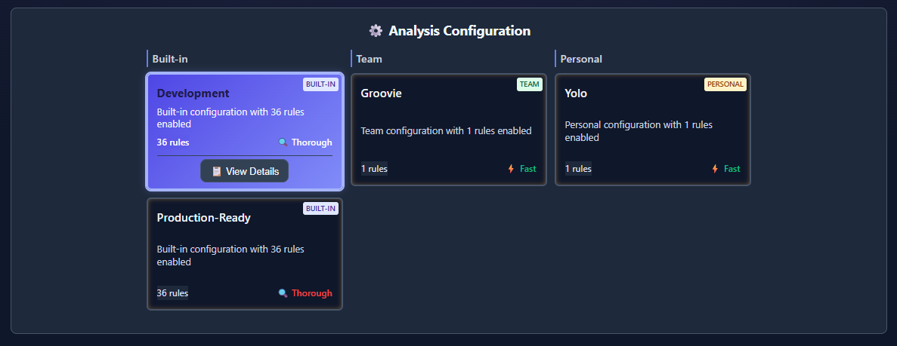
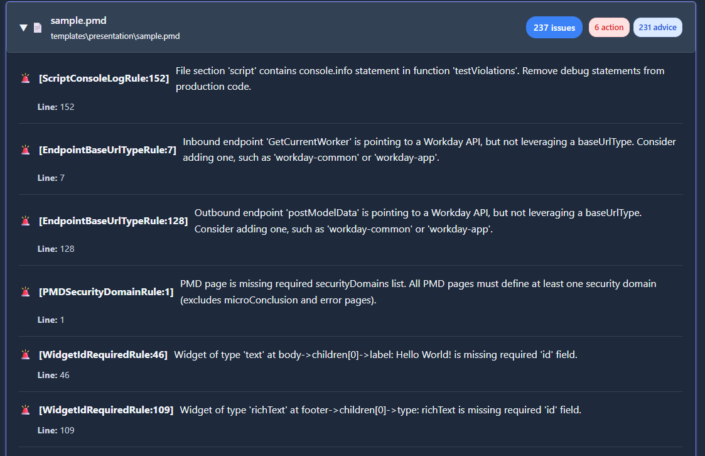

*A mystical code review tool for Workday Extend applications.*

> ⚗️ **Validate. Visualize. Improve.** — PMD, Pod, and Script compliance with wizard-level precision.


[](release_notes/RELEASE_NOTES_0.4.0-beta.1.md)
[](https://github.com/Developers-and-Dragons/ArcaneAuditor/releases)

## 🎯 Overview

Arcane Auditor channels ancient wisdom through **many comprehensive validation rules** to reveal hidden quality violations that compilers cannot detect but master code wizards should catch. This mystical tool analyzes:

- **📄 PMD Files**: Page definitions with embedded scripts, endpoints, and presentation layers
- **🧩 Pod Files**: Pod files with template widgets and endpoint configurations
- **📜 Script Files**: Standalone .script files with function libraries and utilities

**Key Features:**

- 🎯 **Exact (hopefully!) Line Numbers**: Hash-based mapping pinpoints violations
- 🧭 **Readable Violation Paths**: Uses widget IDs, labels, and types to indicate where an issue is found
- ✅ **Intelligent Detection**: Accurately tracks function usage, unused code, and code complexity
- 🛡️ **Update-Safe Configuration**: Layered config system protects your customizations
- 🎨 **Clear Messages**: Actionable violation messages with locations and fix suggestions
- 🧠 **Context Awareness**: Understands when analysis is partial due to missing files

> 🧙‍♂️ **Tip:** Use the [web interface](#-arcane-auditor-web-user-interface) for the fastest start, or jump to [Quick Start](#-quick-start) to begin immediately.

## 🗂️ Table of Contents

- [🚀 Quick Start](#-quick-start)
- [🌐 Web Interface](#-arcane-auditor-web-user-interface)
- [🧠 Context Awareness](#-context-awareness)
- [🛡️ Configuration System](#-update-safe-configuration-system)
- [🔧 Validation Rules](#-validation-rules)
- [🛠️ Development](#-development)
  - [🤝 Contributing](#contributing)
- [📚 Documentation](#-documentation)
- [📄 License](#-license)

## 🖼️ Web Interface Screenshots

### Dark Mode Interface



### Light Mode Interface



<details>
<summary>📸 More Screenshots (click to expand)</summary>

**Upload View:**


**Issues View:**


**Configuration View:**


**Details View:**


</details>

*The mystical web interface provides an intuitive way to upload and analyze your Workday Extend applications with real-time results and downloadable reports.*

## 🚀 Quick Start

> ⚙️ **Requirements:** Python 3.8+, UV package manager, Git

### 🧙‍♂️ Quick Start (Web UI)

**Getting Started in 30 Seconds:**

1. **Download** the latest release from [GitHub Releases](https://github.com/Developers-and-Dragons/ArcaneAuditor/releases)
2. **Extract** the archive to your desired location
3. **Run** the web interface:
   ```bash
   uv run web/server.py --port 8080
   ```
4. **Open** [http://localhost:8080](http://localhost:8080) in your browser
5. **Upload** your ZIP file or individual PMD/Pod/Script files
6. **Review** the analysis results and download Excel reports

---

### ⚔️ Quick Start (Command Line)

```bash
# Analyze a complete application archive
uv run main.py review-app myapp.zip

# Analyze individual files
uv run main.py review-app file1.pmd file2.pod file3.script

# Use specific configuration
uv run main.py review-app myapp.zip --config my-config.json
```

💡 **Need more setup paths?** See [Installation Options](#-installation-options)

[⬆️ Back to Top](#-table-of-contents)

<details>
<summary>📦 Installation Options (click to expand)</summary>

### Option A: Direct Download (Recommended)

1. Download the latest release from [GitHub Releases](https://github.com/Developers-and-Dragons/ArcaneAuditor/releases)
2. Extract the archive to your desired location
3. Install dependencies:
   ```bash
   uv sync
   ```

### Option B: Clone Repository

```bash
git clone https://github.com/Developers-and-Dragons/ArcaneAuditor.git
cd ArcaneAuditor
uv sync
```

### Option C: Development Setup

```bash
git clone https://github.com/Developers-and-Dragons/ArcaneAuditor.git
cd ArcaneAuditor
uv sync --dev
uv run pytest  # Run tests
```

</details>

## 🌐 Arcane Auditor Web User Interface

*For most users, this is the easiest way to run Arcane Auditor.*

The web interface provides a modern, intuitive way to analyze your Workday Extend applications:

### **Features:**

- **📁 Drag & Drop Upload**: Easy file selection with support for ZIP archives and individual files
- **⚙️ Configuration Selection**: Choose from predefined analysis configurations
- **📊 Real-time Results**: Quick analysis with detailed violation reports
- **📥 Excel Export**: Download comprehensive reports with context information
- **🌙 Theme Support**: Dark and light mode themes

### **Starting the Web Server:**

**Default port (8080):**

```bash
uv run web/server.py
```

**Custom port (8090):**

```bash
uv run web/server.py --port 8090
```

**Background mode:**

```bash
uv run web/server.py --port 8080 &
```

> 💡 **Tip:** The web interface provides intelligent [context awareness](#-context-awareness) to help you understand when analysis is complete or partial.

<details>
<summary>🔗 API Endpoints (click to expand)</summary>

- `GET /` - Main interface
- `POST /upload` - File upload endpoint
- `GET /job/{job_id}` - Job status
- `GET /download/{job_id}/excel` - Download Excel report
- `GET /configurations` - Available configurations
- `GET /static/{file}` - Static assets (CSS, JS, images)

</details>

[⬆️ Back to Top](#-table-of-contents)

## 🧠 Context Awareness

<details>
<summary>🧠 Context Awareness (click to expand)</summary>

Arcane Auditor provides **intelligent context awareness** to help you understand when analysis is complete or partial:

| Mode     | Description                | Example Command                                      |
| -------- | -------------------------- | ---------------------------------------------------- |
| Complete | Full set of files provided | `uv run main.py review-app myapp.zip`              |
| Partial  | Missing AMD or SMD files  | `uv run main.py review-app mypage.pmd`             |

### **Complete Analysis** ✅

When you provide all relevant files (PMD, AMD, SMD), Arcane Auditor runs **all enabled validation rules** and provides comprehensive coverage.

### **Partial Analysis** ⚠️

When files are missing, Arcane Auditor:

- **Runs available rules** on provided files
- **Clearly indicates** which files are missing
- **Shows which rules** couldn't be executed
- **Provides guidance** on what to add for complete validation

### **Supported Analysis Modes**

**ZIP File Analysis:**

```bash
# Complete application archive
uv run main.py review-app myapp.zip
```

**Individual File Analysis:**

```bash
# Single PMD file
uv run main.py review-app mypage.pmd

# Multiple files
uv run main.py review-app file1.pmd file2.pod file3.script
```

**Mixed Analysis:**

```bash
# Some files from archive, some individual
uv run main.py review-app myapp.zip additional-file.script
```

### **Context Information Display**

The tool provides clear context information in all output formats:

**Console Output:**

```
📊 Analysis Context:
✅ Complete Analysis - All files provided
📁 Files Analyzed: 15
📄 Files Present: 15
⚠️ Files Missing: 0
🔧 Rules Executed: 45
```

**Excel Reports:**

- Dedicated "Context" sheet with analysis completeness
- Clear indication of missing files and their impact
- Guidance on achieving complete analysis

**Web Interface:**

- Context panel showing analysis status
- Visual indicators for complete vs. partial analysis
- Recommendations for improving analysis coverage

[⬆️ Back to Top](#-table-of-contents)

</details>

## 🛡️ Update-Safe Configuration System

<details>
<summary>🛡️ Update-Safe Configuration System (click to expand)</summary>

Arcane Auditor uses a **layered configuration system** that protects your customizations during updates:

### **Configuration Layers (Priority Order):**

1. **Command Line Arguments** (highest priority)
2. **User Configuration File** (`~/.arcane-auditor/config.json`)
3. **Project Configuration File** (`arcane-auditor.json`)
4. **Default Configuration** (built-in)

### **Configuration File Structure:**

```json
{
  "rules": {
    "script": {
      "enabled": true,
      "max_complexity": 10,
      "max_function_length": 50
    },
    "structure": {
      "enabled": true,
      "check_hardcoded_values": true,
      "require_widget_labels": true
    }
  },
  "output": {
    "format": "console",
    "include_context": true,
    "excel_include_context_sheet": true
  }
}
```

### **Creating Custom Configurations:**

```bash
# Generate default configuration
uv run main.py generate-config > my-config.json

# Use custom configuration
uv run main.py review-app myapp.zip --config my-config.json
```

### **Configuration Inheritance:**

- **User config** inherits from **default config**
- **Project config** inherits from **user config**
- **Command line** overrides all config files
- **Missing settings** fall back to defaults

This ensures your customizations persist through updates while allowing flexibility for different projects.

[⬆️ Back to Top](#-table-of-contents)

</details>

## 🔧 Validation Rules

### Categories

- 🧠 [Script Quality Rules](#-script-quality-rules)
- 🏗️ [Structure Validation Rules](#-structure-validation-rules)
- ⚙️ [Custom Rule Development](#-custom-rule-development)

<details>
<summary>🔧 Script Quality Rules (click to expand)</summary>

### **Script Syntax & Structure**

- **Valid JavaScript Syntax**: Ensures all script code follows proper JavaScript syntax
- **Function Declaration Validation**: Validates function declarations and their parameters
- **Variable Declaration**: Checks for proper variable declarations and scope
- **Control Flow Validation**: Validates if/else, loops, and other control structures

### **Code Complexity & Quality**

- **Cyclomatic Complexity**: Measures code complexity (default threshold: 10)
- **Function Length**: Limits function length (default: 50 lines)
- **Nested Depth**: Prevents excessive nesting (default: 4 levels)
- **Code Duplication**: Detects repeated code patterns

### **Naming Conventions**

- **Function Naming**: Enforces camelCase for function names
- **Variable Naming**: Ensures consistent variable naming
- **Constant Naming**: Validates constant naming conventions
- **Parameter Naming**: Checks parameter naming consistency

### **Unused Code Detection**

- **Unused Functions**: Identifies functions that are never called
- **Unused Variables**: Finds variables that are declared but never used
- **Dead Code**: Detects unreachable code blocks
- **Unused Parameters**: Identifies function parameters that aren't used

[⬆️ Back to Top](#-table-of-contents)

</details>

<details>
<summary>🔧 Structure Validation Rules (click to expand)</summary>

### **Widget Configuration**

- **Required Fields**: Ensures all required widget fields are present
- **Field Validation**: Validates field types and constraints
- **Widget Hierarchy**: Checks proper widget nesting and relationships
- **Component Validation**: Validates component configurations

### **PMD File Structure**

- **Page Definition**: Validates page structure and metadata
- **Endpoint Configuration**: Checks endpoint definitions and parameters
- **Presentation Layer**: Validates UI component configurations
- **Data Binding**: Ensures proper data binding configurations

### **Pod File Validation**

- **Template Structure**: Validates pod template structure
- **Widget Definitions**: Checks widget definitions and properties
- **Endpoint Integration**: Validates endpoint connections
- **Data Flow**: Ensures proper data flow between components

### **Best Practices**

- **Hardcoded Values**: Detects hardcoded values that should be configurable
- **Security Practices**: Validates security-related configurations
- **Performance Optimization**: Checks for performance-related issues
- **Accessibility**: Validates accessibility compliance

[⬆️ Back to Top](#-table-of-contents)

</details>

<details>
<summary>🔧 Custom Rule Development (click to expand)</summary>

### **Creating Custom Rules**

Arcane Auditor supports custom rule development through a plugin system:

```python
# Example custom rule
class CustomScriptRule(BaseRule):
    def __init__(self):
        super().__init__(
            rule_id="custom_script_rule",
            description="Custom script validation rule",
            severity="ADVICE"
        )
  
    def validate(self, file_content, file_path):
        violations = []
        # Your custom validation logic here
        return violations
```

### **Rule Registration**

```python
# Register custom rule
from arcane_auditor.rules import RuleRegistry

RuleRegistry.register(CustomScriptRule())
```

### **Rule Configuration**

Custom rules can be configured through the configuration system:

```json
{
  "rules": {
    "custom": {
      "custom_script_rule": {
        "enabled": true,
        "threshold": 5
      }
    }
  }
}
```

[⬆️ Back to Top](#-table-of-contents)

</details>

## 🛠️ Development

<details>
<summary>🛠️ Development Setup (click to expand)</summary>

### **Prerequisites**

- Python 3.8+
- uv package manager
- Git

### **Setup Development Environment**

```bash
# Clone repository
git clone https://github.com/Developers-and-Dragons/ArcaneAuditor.git
cd ArcaneAuditor

# Install dependencies
uv sync --dev

# Run tests
uv run pytest

# Run linting
uv run ruff check .

# Format code
uv run ruff format .
```

### **Project Structure**

**Project Structure Overview**

```
arcane_auditor/   → Core validation engine
web/              → Web interface (FastAPI + frontend)
tests/            → Automated test suite
config/           → Presets, team, and personal configs
docs/             → Detailed documentation and rule breakdowns
```

> 🧩 **New contributor?** See [Project Structure](docs/project-structure.md) for an overview of core directories and their roles.

<details>
<summary>📁 Detailed Project Structure (click to expand)</summary>

```
ArcaneAuditor/
├── arcane_auditor/           # Main package
│   ├── __init__.py
│   ├── main.py              # CLI entry point
│   ├── rules/               # Validation rules
│   │   ├── __init__.py
│   │   ├── base.py          # Base rule classes
│   │   ├── script.py        # Script validation rules
│   │   └── structure.py     # Structure validation rules
│   ├── parser/              # File parsing
│   │   ├── __init__.py
│   │   ├── pmd_parser.py    # PMD file parser
│   │   ├── pod_parser.py    # Pod file parser
│   │   └── script_parser.py # Script file parser
│   ├── output/              # Output formatting
│   │   ├── __init__.py
│   │   ├── formatter.py     # Output formatters
│   │   └── excel.py         # Excel report generation
│   └── config/              # Configuration management
│       ├── __init__.py
│       ├── loader.py        # Configuration loading
│       └── validator.py     # Configuration validation
├── web/                     # Web interface
│   ├── server.py           # FastAPI server
│   └── frontend/           # Frontend assets
│       ├── index.html      # Main HTML
│       ├── style.css       # Styling
│       └── script.js       # JavaScript
├── tests/                   # Test suite
│   ├── __init__.py
│   ├── test_rules_engine.py # Core rules engine tests
│   ├── test_script_*.py     # Script validation rule tests
│   ├── test_endpoint_*.py   # Endpoint validation tests
│   ├── test_widget_*.py     # Widget validation tests
│   ├── test_context_*.py    # Context awareness tests
│   └── test_*.py            # Additional integration tests
├── samples/                 # Sample files
│   ├── templates/          # Template files
│   └── archives/          # Sample archives
├── docs/                    # Documentation
│   ├── rules.md           # Rule documentation
│   └── api.md             # API documentation
├── assets/                  # Static assets
│   ├── logo.png           # Logo
│   └── screenshots/        # Screenshots
├── release_notes/          # Release notes
├── pyproject.toml          # Project configuration
├── README.md              # This file
└── LICENSE                # License
```

</details>

### **Running Tests**

```bash
# Run all tests
uv run pytest

# Run specific test file
uv run pytest tests/test_rules.py

# Run with coverage
uv run pytest --cov=arcane_auditor
```

### **Contributing**

1. Fork the repository
2. Create a feature branch: `git checkout -b feature-name`
3. Make your changes
4. Add tests for new functionality
5. Run the test suite: `uv run pytest`
6. Commit your changes: `git commit -m "Add feature"`
7. Push to your fork: `git push origin feature-name`
8. Create a Pull Request

### **Code Style**

- Follow PEP 8 guidelines
- Use type hints where appropriate
- Write comprehensive docstrings
- Include unit tests for new features
- Use meaningful commit messages

[⬆️ Back to Top](#-table-of-contents)

</details>

[⬆️ Back to Top](#-table-of-contents)

## 📚 Documentation

- **[Rule Documentation](docs/rules.md)** - Detailed rule descriptions and examples
- **[API Documentation](docs/api.md)** - API reference and examples
- **[Configuration Guide](config/README.md)** - Configuration options and examples
- **[Release Notes](release_notes/)** - Version history and changes

## 📄 License

This project is licensed under the MIT License - see the [LICENSE](LICENSE) file for details.

---

⭐ **If Arcane Auditor helps you, star the repo and share the magic!**

*May the Weave guide your code to perfection!* ✨
