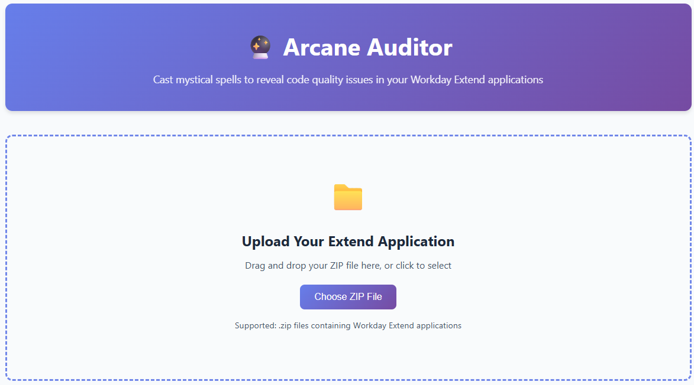
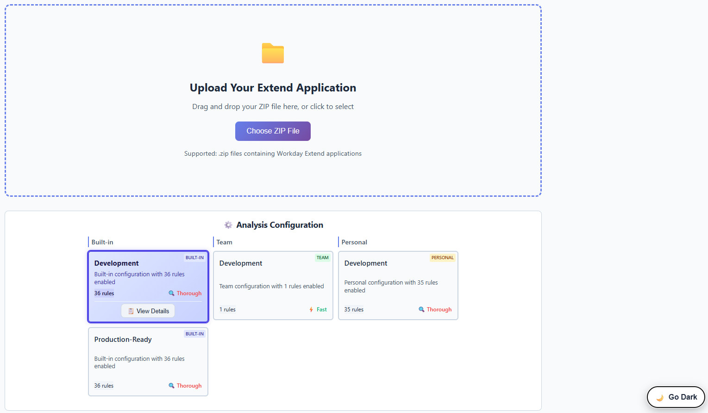
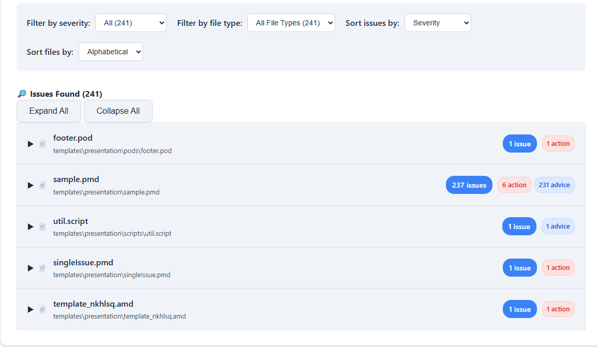
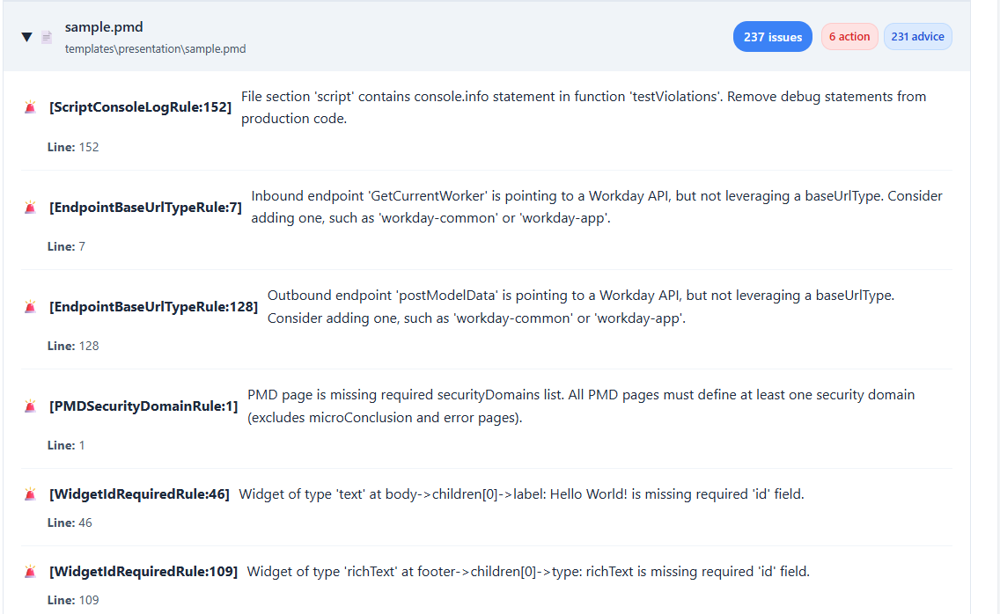

**Version: 0.4.0-beta.1** | [📋 Release Notes](release_notes/RELEASE_NOTES_0.4.0-beta.1.md) | [🚀 Download Latest](https://github.com/Developers-and-Dragons/ArcaneAuditor/releases/tag/v0.4.0-beta.1)

*A mystical code review tool for Workday Extend applications that validates PMD, Pod, and Script syntax, structure compliance, and coding best practices.*

## 🎯 Overview

Arcane Auditor channels ancient wisdom through **many comprehensive validation rules** to reveal hidden quality violations that compilers cannot detect but master code wizards should catch. This mystical tool analyzes:

- **📄 PMD Files**: Page definitions with embedded scripts, endpoints, and presentation layers
- **🧩 Pod Files**: Pod files with template widgets and endpoint configurations
- **📜 Script Files**: Standalone .script files with function libraries and utilities

**Key Features:**

- 🎯 **Exact (hopefully!) Line Numbers**: Hash-based mapping pinpoints violations
- 🧭 **Readable Violation Paths**: Uses widget IDs, labels, and types to indicate where an issue is found
- ✅ **Intelligent Detection**: Accurately tracks function usage, unused code, and code complexity
- 🛡️ **Update-Safe Configuration**: Layered config system protects your customizations
- 🎨 **Clear Messages**: Actionable violation messages with locations and fix suggestions
- 🧠 **Context Awareness**: Understands when analysis is partial due to missing files

**Rule Categories:**

- **Script Quality**: Script syntax, complexity, naming conventions, unused code detection
- **Structure Validation**: Widget configurations, required fields, component validation, hardcoded values, endpoint compliance

## 🧠 Context Awareness

Arcane Auditor provides **intelligent context awareness** to help you understand when analysis is complete or partial:

### **Complete Analysis** ✅
When you provide all relevant files (PMD, AMD, SMD), Arcane Auditor runs **all validation rules** and provides comprehensive coverage.

### **Partial Analysis** ⚠️
When files are missing, Arcane Auditor:
- **Runs available rules** on provided files
- **Clearly indicates** which files are missing
- **Shows which rules** couldn't be executed
- **Provides guidance** on what to add for complete validation

### **Supported Analysis Modes**

**ZIP File Analysis:**
```bash
# Complete application archive
uv run main.py review-app myapp.zip
```

**Individual File Analysis:**
```bash
# Single file
uv run main.py review-app page.pmd

# Multiple files
uv run main.py review-app page.pmd app.smd app.amd

# Directory scan
uv run main.py review-app presentation/
```

**Web Interface:**
- Upload ZIP files or individual files
- Drag and drop support
- Real-time context panel showing analysis status
- Visual indicators for complete vs partial analysis

### **Context Information Displayed**

- **📁 Files Processed**: Shows which files were successfully analyzed
- **⚠️ Files Needed**: Indicates missing AMD/SMD files for complete validation
- **🚫 Checks Skipped**: Lists rules that couldn't run due to missing context
- **💡 Tips**: Actionable guidance for complete validation

### **Example Output**

```
📊 Analysis Summary                    [⚠️ Partial]
▼
  ✅ Files Processed (1)
     📄 page.pmd
  
  ⚠️ Files Needed for Full Validation
     [ AMD ] [ SMD ]
  
  🚫 Checks Skipped
     Some rules could not be evaluated due to missing file types.
     • AMDDataprov…Rule — Skipped — missing required AMD file.
  
  💡 Tip: Add AMD and SMD files for complete application validation.
```

This ensures you always know **exactly what was validated** and **what might be missing** for comprehensive analysis.

## 🛡️ Update-Safe Configuration System

Arcane Auditor features a **consolidated layered configuration system** that protects your customizations during app updates:

- **🔒 Presets** (`config/presets/`) - Built-in configurations (updated with app)
- **🛡️ Teams** (`config/teams/`) - Team/project settings (update-safe)
- **🏠 Personal** (`config/personal/`) - Personal overrides (highest priority)

### Available Presets

- **Development** (`development.json`) - Development-friendly validation allowing console.debug, etc.
- **Production-Ready** (`production-ready.json`) - Pre-deployment validation with strict settings

```bash
# List all available configurations and safety status
uv run main.py list-configs

# Use team configuration (searches all directories)
uv run main.py review-app myapp.zip --config development

# Use explicit path
uv run main.py review-app myapp.zip --config config/personal/my-config.json
```

Your customizations in `config/teams/` and `config/personal/` are **completely protected** from app updates! 🛡️

## 🚀 Quick Start

### Prerequisites

Before installing Arcane Auditor, you'll need:

#### 1. **Python 3.8+**

- **Windows**: Download from [python.org](https://www.python.org/downloads/) or install via [Microsoft Store](https://www.microsoft.com/store/productId/9NRWMJP3717K)
- **macOS**: `brew install python` or download from [python.org](https://www.python.org/downloads/)
- **NOTE**: If using UV (see below), you don't need to install Python. It will be downloaded and run in the project folder for you.

#### 2. **Git** (for cloning the repository)

- **Windows**: Download from [git-scm.com](https://git-scm.com/download/win)
- **macOS**: `brew install git` or download from [git-scm.com](https://git-scm.com/download/mac)

#### 3. **UV** (Modern Python package manager - **recommended**)

```bash
# Windows (PowerShell)
powershell -c "irm https://astral.sh/uv/install.ps1 | iex"

# MacOS (Shell w/Curl)
curl -LsSf https://astral.sh/uv/install.sh | sh

# Or using pip (if you prefer)
pip install uv
```

> **💡 Why UV?** UV is 10-100x faster than pip and handles dependencies more reliably. [Learn more](https://github.com/astral-sh/uv)

### Installation

#### **Option A: Download Release (Easiest)**

```bash
# Download the latest release ZIP from GitHub
# Visit: https://github.com/Developers-and-Dragons/ArcaneAuditor/releases
# Download arcane-auditor-0.4.0-beta.1.zip and extract it

# Or using command line (Windows PowerShell)
Invoke-WebRequest -Uri "https://github.com/Developers-and-Dragons/ArcaneAuditor/archive/refs/tags/v0.4.0-beta.1.zip" -OutFile "arcane-auditor.zip"
Expand-Archive -Path "arcane-auditor.zip" -DestinationPath "."
cd ArcaneAuditor-0.4.0-beta.1

# Or using command line (macOS)
curl -L -o arcane-auditor.zip "https://github.com/Developers-and-Dragons/ArcaneAuditor/archive/refs/tags/v0.4.0-beta.1.zip"
unzip arcane-auditor.zip
cd ArcaneAuditor-0.4.0-beta.1

# Install dependencies (UV handles Python version and virtual environment automatically)
uv sync

# Run analysis on a Workday Extend application
uv run main.py review-app your-app.zip
```

#### **Option B: Git Clone (Recommended For Developers)**

```bash
# Clone the repository (SSH - if you have GitHub SSH keys)
git clone git@github.com:Developers-and-Dragons/ArcaneAuditor.git arcane-auditor

# Or using HTTPS (works for everyone)
git clone https://github.com/Developers-and-Dragons/ArcaneAuditor.git arcane-auditor

cd arcane-auditor

# Install dependencies (UV handles Python version and virtual environment automatically)
uv sync

# Run analysis on a Workday Extend application
uv run main.py review-app your-app.zip
```

#### **Option C: Using Traditional pip**

```bash
# Clone the repository
git clone https://github.com/Developers-and-Dragons/ArcaneAuditor.git arcane-auditor
cd arcane-auditor

# Create virtual environment (recommended)
python -m venv .venv

# Activate virtual environment
# Windows:
.venv\Scripts\activate
# macOS:
source .venv/bin/activate

# Install dependencies
pip install -r requirements.txt

# Run analysis
python main.py review-app your-app.zip
```

### Verify Installation

```bash
# Check that everything is working
uv run main.py --help
```

You should see mystical analysis output with validation findings! 🔮

## 🆕 What's New in 0.4.0-beta.1

This release brings **context awareness**, enhanced analysis modes, and significant user experience improvements:

### 🧠 Context Awareness (NEW!)

- **Intelligent Analysis Detection**: Automatically detects when analysis is complete or partial
- **Missing File Guidance**: Shows which AMD/SMD files are needed for complete validation
- **Skipped Rule Transparency**: Lists which rules couldn't run due to missing context
- **Multiple Analysis Modes**: Support for ZIP files, individual files, and directory scanning
- **Cross-Platform Support**: Context awareness in CLI, Web UI, JSON, and Excel outputs

### 🌐 Web Interface Enhancements

- **Multiple File Upload**: Support for individual files (.pmd, .pod, .amd, .smd, .script) in addition to ZIP files
- **Context Awareness Panel**: Real-time display of analysis completeness and missing dependencies
- **Enhanced User Experience**: Improved layout with file upload at top, configuration selection below
- **Definitive Scroll Jiggle Fix**: 2-part solution eliminating all layout shifts and scroll bar jumping
- **Enhanced Dark Mode**: Fixed hover text readability and improved contrast across all components
- **Cross-Platform Startup Scripts**: Windows (`.bat`) and Linux/macOS (`.sh`) convenience scripts

### Web Interface (Recommended)

For a user-friendly mystical web interface with FastAPI backend:

#### **Start Web Interface**

```bash
# Start the FastAPI web server
# Make sure you're in the project directory with dependencies available
# Adjust port as necessary - defaults to port 8080
uv run python web/server.py --port 8081

# Or if you have a virtual environment activated:
python web/server.py --port 8081

# Open your browser to: http://localhost:8081
# API documentation available at: http://localhost:8081/docs
```

The web interface provides:

- **Drag & drop file upload** for ZIP files and individual files
- **Multiple file upload** support for PMD, POD, AMD, SMD, and SCRIPT files
- **Dynamic configuration selection** with interactive cards showing all available configs (presets, teams, personal)
- **Real-time analysis** with all validation rules
- **Context awareness panel** showing analysis completeness and missing files
- **Asynchronous processing** - Multiple users can upload files simultaneously
- **Configuration persistence** - Remembers your last selected configuration
- **Dark/light mode** toggle
- **Results filtering** and sorting
- **Excel export** functionality

> **🌐 Web Interface Benefits:** Drag-and-drop file upload, interactive results, configuration management, beautiful mystical UI, and modern FastAPI backend with automatic API documentation!

#### **Convenient Startup Scripts**

For easier web service startup, use the provided scripts instead of remembering the command syntax:

**Windows:**

```bash
# Simple startup (opens browser automatically)
start-web-service.bat

# Advanced startup with options
start-web-service.bat --port 3000 --host 0.0.0.0
```

**Linux/macOS:**

```bash
# Simple startup (opens browser automatically)
./start-web-service.sh

# Advanced startup with options
./start-web-service.sh --port 3000 --host 0.0.0.0
```

See [`WEB_SERVICE_SCRIPTS.md`](WEB_SERVICE_SCRIPTS.md) for detailed usage instructions and all available options.

For a complete overview of all validation rules, see [`parser/rules/RULE_BREAKDOWN.md`](parser/rules/RULE_BREAKDOWN.md).

#### **API Endpoints**

The FastAPI server provides the following REST API endpoints:

- **`POST /api/upload`** - Upload files for analysis

  - Returns: `{"job_id": "uuid", "status": "queued"}`
  - Content-Type: `multipart/form-data`
  - Parameters: `files` (required, supports multiple files), `config` (optional, defaults to "development")
  - Supports: ZIP files or individual .pmd, .pod, .amd, .smd, .script files
- **`GET /api/job/{job_id}`** - Get analysis job status and results

  - Returns: `{"job_id": "uuid", "status": "completed|running|failed", "result": {...}, "context": {...}}`
  - Includes context awareness information about analysis completeness
- **`GET /api/download/{job_id}`** - Download analysis results as Excel file

  - Returns: Excel file (.xlsx) with findings, summary, and context information
- **`GET /api/configs`** - Get available configurations

  - Returns: List of available configurations with metadata
- **`GET /api/health`** - Health check endpoint

  - Returns: `{"status": "healthy"}`
- **`GET /docs`** - Interactive API documentation (Swagger UI)

## 🧙‍♂️ Arcane Auditor Web User Interface

Arcane Auditor offers both **Dark** and **Light** themes — revealing code quality insights in true mystical style.

<h3>🪄 Upload Your Extend Application</h3>
<p align="center">
  
  
</p>

<h3>⚙️ Choose Your Configuration</h3>
<p align="center">
  
  
</p>

<h3>📊 View Analysis Results</h3>
<p align="center">
  
  
</p>

<h3>🗂️ Browse Issues by File</h3>
<p align="center">
  
  
</p>

<h3>🔍 Inspect Detailed Rule Violations</h3>
<p align="center">
  
  
</p>

### Basic Usage

```bash
# Analyze a complete PMD application archive
uv run main.py review-app myapp.zip

# Analyze individual files
uv run main.py review-app page.pmd
uv run main.py review-app page.pmd app.smd app.amd

# Analyze all files in a directory
uv run main.py review-app presentation/

# Use custom magical configuration (supports layered loading)
uv run main.py review-app myapp.zip --config development

# List available configurations
uv run main.py list-configs
```

## 📁 Project Structure

```
arcane-auditor/
├── main.py                                         	# Main application entry point
├── requirements.txt                                	# Python dependencies
├── pyproject.toml                                  	# Project configuration
├── README.md                                       	# This file
├── LICENSE                                         	# MIT License
├── uv.lock                                         	# UV package lock file
├── start-web-service.bat                          	# Windows web service startup script
├── start-web-service.sh                           	# Linux/macOS web service startup script
├── WEB_SERVICE_SCRIPTS.md                         	# Web service scripts documentation
│
├── assets/                                         	# Static assets
│   ├── arcane-auditor-logo.png                     	# Project logo
│   ├── config-dark.png                             	# Web UI config selection (dark mode)
│   ├── config-light.png                            	# Web UI config selection (light mode)
│   ├── details-dark.png                            	# Web UI configuration details (dark mode)
│   ├── details-light.png                           	# Web UI configuration details (light mode)
│   ├── issues-dark.png                             	# Web UI issues view (dark mode)
│   ├── issues-light.png                            	# Web UI issues view (light mode)
│   ├── results-dark.png                            	# Web UI results view (dark mode)
│   ├── results-light.png                           	# Web UI results view (light mode)
│   ├── upload-dark.png                             	# Web UI upload view (dark mode)
│   └── upload-light.png                            	# Web UI upload view (light mode)
│
├── config/                                         	# Consolidated configurations
│   ├── README.md                                   	# Configuration guide
│   ├── presets/                                    	# Built-in configurations (updated with app)
│   │   ├── development.json                        	# Development-friendly validation
│   │   └── production-ready.json                   	# Pre-deployment validation
│   ├── teams/                                      	# Team/project settings (update-safe)
│   └── personal/                                   	# Personal overrides (highest priority)
│
├── file_processing/                                	# File processing pipeline
│   ├── __init__.py
│   ├── config.py                                   	# Configuration models
│   ├── models.py                                   	# Data models
│   └── processor.py                                	# Main processing logic
│
├── output/                                         	# Output formatting
│   ├── __init__.py
│   └── formatter.py                                	# Results formatting utilities
│
├── parser/                                         	# PMD parsing and validation
│   ├── __init__.py
│   ├── app_parser.py                               	# Main application parser
│   ├── config.py                                   	# Parser configuration
│   ├── config_manager.py                           	# Configuration management
│   ├── models.py                                   	# Parser data models
│   ├── pmd_script_parser.py                        	# PMD Script parser
│   ├── pmd_script_grammar.lark                     	# PMD Script grammar definition
│   ├── pmd_preprocessor.py                         	# PMD file preprocessing
│   ├── rules_engine.py                             	# Rules discovery and execution
│   │
│   └── rules/                                      	# Validation rules engine
│       ├── __init__.py                             	# Rules package
│       ├── base.py                                 	# Base Rule class and utilities
│       ├── common_validations.py                   	# Shared validation functions
│       ├── RULE_BREAKDOWN.md                       	# Complete rules documentation
│       │
│       ├── common/                                 	# Shared rule utilities
│       │   ├── __init__.py
│       │   ├── line_utils.py                       	# Line number utilities
│       │   └── violation.py                        	# Violation dataclass
│       │
│       ├── script/                                 	# Script validation rules
│       │   ├── __init__.py
│       │   │
│       │   ├── shared/                             	# Shared script rule components
│       │   │   ├── __init__.py
│       │   │   ├── rule_base.py                    	# ScriptRuleBase class
│       │   │   ├── detector.py                     	# ScriptDetector abstract class
│       │   │   ├── violation.py                    	# Script violation dataclass
│       │   │   ├── ast_utils.py                    	# AST manipulation utilities
│       │   │   └── template_literal_preprocessor.py	# Template literal preprocessing
│       │   │
│       │   ├── core/                               	# Basic syntax/style rules
│       │   │   ├── __init__.py
│       │   │   ├── var_usage.py                    	# ScriptVarUsageRule
│       │   │   ├── var_usage_detector.py
│       │   │   ├── script_dead_code.py        	# ScriptDeadCodeRule
│       │   │   ├── script_dead_code_detector.py
│       │   │   ├── variable_naming.py              	# ScriptVariableNamingRule
│       │   │   ├── variable_naming_detector.py
│       │   │   ├── console_log.py                  	# ScriptConsoleLogRule
│       │   │   └── console_log_detector.py
│       │   │
│       │   ├── complexity/                         	# Code complexity rules
│       │   │   ├── __init__.py
│       │   │   ├── nesting_level.py                	# ScriptNestingLevelRule
│       │   │   ├── nesting_level_detector.py
│       │   │   ├── cyclomatic_complexity.py        	# ScriptComplexityRule
│       │   │   ├── cyclomatic_complexity_detector.py
│       │   │   ├── long_function.py                	# ScriptLongFunctionRule
│       │   │   ├── long_function_detector.py
│       │   │   ├── long_script_block.py            	# LongScriptBlockRule
│       │   │   ├── long_script_block_detector.py
│       │   │   ├── function_parameter_count.py     	# ScriptFunctionParameterCountRule
│       │   │   └── function_parameter_count_detector.py
│       │   │
│       │   ├── unused_code/                        	# Dead code detection
│       │   │   ├── __init__.py
│       │   │   ├── unused_variables.py             	# ScriptUnusedVariableRule
│       │   │   ├── unused_variables_detector.py
│       │   │   ├── unused_parameters.py            	# ScriptUnusedFunctionParametersRule
│       │   │   ├── unused_parameters_detector.py
│       │   │   ├── unused_functions.py             	# ScriptUnusedFunctionRule
│       │   │   ├── unused_functions_detector.py
│       │   │   ├── unused_script_includes.py       	# ScriptUnusedScriptIncludesRule
│       │   │   ├── unused_script_includes_detector.py
│       │   │   ├── empty_functions.py              	# ScriptEmptyFunctionRule
│       │   │   └── empty_function_detector.py
│       │   │
│       │   └── logic/                              	# Logic/flow rules
│       │       ├── __init__.py
│       │       ├── magic_numbers.py                	# ScriptMagicNumberRule
│       │       ├── magic_number_detector.py
│       │       ├── null_safety.py                  	# ScriptNullSafetyRule
│       │       ├── null_safety_detector.py
│       │       ├── descriptive_parameters.py       	# ScriptDescriptiveParameterRule
│       │       ├── descriptive_parameters_detector.py
│       │       ├── array_method_usage.py      	# ScriptArrayMethodUsageRule
│       │       ├── array_method_usage_detector.py
│       │       ├── verbose_boolean.py              	# ScriptVerboseBooleanCheckRule
│       │       ├── verbose_boolean_detector.py
│       │       ├── return_consistency.py           	# ScriptFunctionReturnConsistencyRule
│       │       ├── return_consistency_detector.py
│       │       ├── string_concat.py                	# ScriptStringConcatRule
│       │       └── string_concat_detector.py
│       │
│       ├── structure/                              	# Structure validation rules
│       │   ├── __init__.py
│       │   │
│       │   ├── shared/                             	# Shared structure rule components
│       │   │   ├── __init__.py
│       │   │   └── rule_base.py                    	# StructureRuleBase class
│       │   │
│       │   ├── widgets/                            	# Widget validation rules
│       │   │   ├── __init__.py
│       │   │   ├── widget_id_required.py           	# WidgetIdRequiredRule
│       │   │   └── widget_id_lower_camel_case.py   	# WidgetIdLowerCamelCaseRule
│       │   │
│       │   ├── endpoints/                          	# Endpoint validation rules
│       │   │   ├── __init__.py
│       │   │   ├── endpoint_name_lower_camel_case.py   # EndpointNameLowerCamelCaseRule
│       │   │   ├── endpoint_on_send_self_data.py       # EndpointOnSendSelfDataRule
│       │   │   ├── endpoint_fail_on_status_codes.py    # EndpointFailOnStatusCodesRule
│       │   │   └── endpoint_url_base_url_type.py       # EndpointUrlBaseUrlTypeRule
│       │   │
│       │   └── validation/                         	# General validation rules
│       │       ├── __init__.py
│       │       ├── amd_data_providers_workday.py   	# AMDDataProvidersWorkdayRule
│       │       ├── footer_pod_required.py          	# FooterPodRequiredRule
│       │       ├── string_boolean.py               	# StringBooleanRule
│       │       ├── embedded_images.py              	# EmbeddedImagesRule
│       │       ├── hardcoded_application_id.py     	# HardcodedApplicationIdRule
│       │       ├── hardcoded_wid.py                	# HardcodedWidRule
│       │       ├── pmd_section_ordering.py         	# PMDSectionOrderingRule
│       │       └── pmd_security_domain.py          	# PMDSecurityDomainRule
│       │
│       └── custom/                                 	# 🆕 User custom rules
│           ├── __init__.py                         	# Custom rules package
│           ├── README.md                           	# Custom rules development guide
│           ├── examples/                           	# Example implementations
│           │   ├── __init__.py
│           │   └── _example_custom_rule.py         	# Sample custom rule
│           └── user/                               	# User's actual custom rules
│               └── __init__.py
│
├── web/                                            	# Web interface
│   ├── server.py                                   	# FastAPI web server
│   ├── uploads/                                    	# Temporary upload directory
│   └── frontend/                                  		# HTML/CSS/JS frontend
│       ├── README.md                              		# Frontend documentation
│       ├── index.html                             		# Main HTML page
│       ├── style.css                               	# Styling with dark mode
│       └── script.js                               	# Client-side functionality
│
├── tests/                                          	# Unit tests
│   ├── __init__.py
│   ├── test_app_parser.py                          	# Application parser tests
│   ├── test_file_processor.py                      	# File processing tests
│   ├── test_finding.py                             	# Finding model tests
│   ├── test_rules_engine.py                        	# Rules engine tests
│   ├── test_all_script_rules.py                   		# All script rules integration tests
│   ├── test_all_structure_rules.py                 	# All structure rules integration tests
│   ├── test_script_complexity_rule.py              	# Complexity rule tests
│   ├── test_script_descriptive_parameters.py       	# Descriptive parameters tests
│   ├── test_script_empty_function_rule.py          	# Empty function tests
│   ├── test_script_dead_code.py               	# Dead code tests
│   ├── test_script_function_parameter_count_rule.py    # Parameter count tests
│   ├── test_script_array_method_usage_rule.py           # Array method tests
│   ├── test_script_verbose_boolean_rule.py         	# Verbose boolean tests
│   ├── test_unused_script_includes.py              	# Unused includes tests
│   ├── test_embedded_images_rule.py                	# Embedded images tests
│   ├── test_endpoint_on_send_self_data.py          	# Endpoint self data tests
│   ├── test_footer_pod_required_rule.py            	# Footer pod tests
│   ├── test_pmd_section_ordering.py                	# PMD section ordering tests
│   ├── test_string_boolean_rule.py                 	# String boolean tests
│   ├── test_widget_traversal.py                    	# Widget traversal tests
│   ├── test_long_script_block_rule.py             	# Long script block tests
│   ├── test_amd_data_providers_workday_rule.py     	# AMD data providers tests
│   └── test_pmd_script_grammar.py                  	# PMD script grammar tests
│
└── uploads/                                        	# Temporary file uploads
```

## 🔧 Validation Rules

### Unified Rule Architecture

Arcane Auditor features a **unified rule architecture** that provides consistency, reusability, and maintainability:

- **`ScriptRuleBase`**: Base class for script analysis rules with built-in PMD/POD/script iteration
- **`StructureRuleBase`**: Base class for structure validation rules with PMD/POD analysis patterns
- **`ScriptDetector`**: Abstract pattern for script analysis with separation of detection logic
- **`Violation`**: Standardized dataclass for reporting code violations
- **Shared utilities**: AST manipulation, line number calculation, and common validations

### Rule Categories

#### Script Rules

**Core Rules** (`parser/rules/script/core/`)

- **ScriptVarUsageRule**: Var Usage Rule - Prefer `let`/`const` over `var`
- **ScriptDeadCodeRule**: Dead Code Rule - Detects dead code in standalone script files
- **ScriptConsoleLogRule**: Console Log Rule - Avoid console statements in production
- **ScriptVariableNamingRule**: Variable Naming Rule - Use lowerCamelCase convention

**Complexity Rules** (`parser/rules/script/complexity/`)

- **ScriptNestingLevelRule**: Nesting Level Rule - Limit code nesting depth
- **ScriptComplexityRule**: Cyclomatic Complexity Rule - Control function complexity
- **ScriptLongFunctionRule**: Long Function Rule - Limit function length
- **ScriptFunctionParameterCountRule**: Function Parameter Count Rule - Limit function parameters

**Unused Code Rules** (`parser/rules/script/unused_code/`)

- **ScriptUnusedVariableRule**: Unused Variables Rule - Remove unused variables
- **ScriptUnusedFunctionParametersRule**: Unused Parameters Rule - Remove unused function parameters
- **ScriptUnusedFunctionRule**: Unused Functions Rule - Remove unused functions
- **ScriptUnusedScriptIncludesRule**: Unused Script Includes Rule - Remove unused script imports
- **ScriptEmptyFunctionRule**: Empty Functions Rule - Remove empty functions

**Logic Rules** (`parser/rules/script/logic/`)

- **ScriptMagicNumberRule**: Magic Numbers Rule - Use named constants
- **ScriptNullSafetyRule**: Null Safety Rule - Proper null checking
- **ScriptDescriptiveParameterRule**: Descriptive Parameters Rule - Use descriptive parameter names
- **ScriptArrayMethodUsageRule**: Array Method Usage Rule - Prefer array higher-order methods over manual loops
- **ScriptVerboseBooleanCheckRule**: Verbose Boolean Rule - Simplify boolean expressions
- **ScriptFunctionReturnConsistencyRule**: Return Consistency Rule - Consistent return patterns
- **ScriptStringConcatRule**: String Concatenation Rule - Use template literals instead of string concatenation

#### Structure Rules

**Widget Rules** (`parser/rules/structure/widgets/`)

- **WidgetIdRequiredRule**: Widget ID Required Rule - All widgets need IDs
- **WidgetIdLowerCamelCaseRule**: Widget ID Lower Camel Case Rule - Widget IDs follow naming convention

**Endpoint Rules** (`parser/rules/structure/endpoints/`)

- **EndpointNameLowerCamelCaseRule**: Endpoint Name Lower Camel Case Rule - Endpoint names follow convention
- **EndpointOnSendSelfDataRule**: Endpoint On Send Self Data Rule - Avoid self.data anti-pattern
- **EndpointFailOnStatusCodesRule**: Endpoint Fail On Status Codes Rule - Proper error handling
- **EndpointBaseUrlTypeRule**: Endpoint Base URL Type Rule - Consistent URL configuration

**Validation Rules** (`parser/rules/structure/validation/`)

- **FooterPodRequiredRule**: Footer Pod Required Rule - Footer must use pod structure (uses StructureRuleBase)
- **StringBooleanRule**: String Boolean Rule - Use boolean values, not strings (uses StructureRuleBase)
- **EmbeddedImagesRule**: Embedded Images Rule - Detect base64 encoded images and large binary content
- **HardcodedApplicationIdRule**: Hardcoded Application ID Rule - Detect hardcoded applicationId values
- **HardcodedWidRule**: Hardcoded WID Rule - Detect hardcoded Workday ID values
- **PMDSectionOrderingRule**: PMD Section Ordering Rule - Consistent file structure and section ordering
- **PMDSecurityDomainRule**: PMD Security Domain Rule - Ensure security domains are defined

#### PMD Rules

**Organization Rules** (`parser/rules/structure/validation/`)

- **PMDSectionOrderingRule**: PMD Section Ordering Rule - Consistent file structure and section ordering
- **PMDSecurityDomainRule**: PMD Security Domain Rule - Ensure security domains are defined

#### Custom Rules

**User Extensions** (`parser/rules/custom/user/`)

- **Custom[Description]Rule**: User-defined validation rules
- See `parser/rules/custom/README.md` for development guide

### Rule Discovery

The rules engine automatically discovers all validation rules using `pkgutil.walk_packages()`. Rules are organized by:

1. **Category**: Script vs Structure vs Custom
2. **Type**: Core, Complexity, Unused Code, Logic, Widgets, Endpoints, Validation
3. **Naming**: Descriptive class names (e.g., `ScriptVarUsageRule`, `WidgetIdRequiredRule`)

## 🛠️ Development

### Adding New Rules

> **⚠️ Important**: To avoid merge conflicts when updating the official codebase, **always use the Custom Rules system** for user-defined validation rules. Only modify official rules if you are a core contributor to the project.

#### For Users: Custom Rules (Recommended)

**Use this approach for your own validation rules:**

1. Place new rules in `parser/rules/custom/user/`
2. Use descriptive class names (e.g., `CustomScriptMyRule`)
3. Follow patterns in `parser/rules/custom/examples/`
4. See `parser/rules/custom/README.md` for detailed guide

**Benefits:**

- ✅ No merge conflicts when updating the official codebase
- ✅ Rules persist through official updates
- ✅ Easy to share and version control your custom rules
- ✅ Automatic discovery by the rules engine

### Testing

```bash
# Run all tests
uv run pytest

# Run specific test categories
uv run pytest tests/test_all_script_rules.py
uv run pytest tests/test_all_structure_rules.py
uv run pytest tests/test_rules_engine.py

# Test with your own Workday Extend application
uv run main.py review-app myapp_abcdef.zip
```

### Configuration

Create custom configurations in JSON format:

```json
{
  "rules": {
    "CustomScriptCommentQualityRule": {
      "enabled": true,
      "severity_override": "ADVICE",
      "custom_settings": {
        "min_comment_density": 0.15
      }
    },
    "ScriptVarUsageRule": {
      "enabled": true,
      "severity_override": "ACTION",
      "custom_settings": {}
    },
    "ScriptMagicNumberRule": {
      "enabled": false,
      "severity_override": null,
      "custom_settings": {}
    }
  }
}
```

## 📚 Documentation

### Core Documentation

- **[📜 Rule Breakdown](parser/rules/RULE_BREAKDOWN.md)**: Comprehensive guide to all validation rules, with examples!
- **[⚙️ Configuration Guide](config/README.md)**: Consolidated configuration system and rule customization

### Advanced Guides

- **[🔧 Custom Rules Development](parser/rules/custom/README.md)**: Create your own validation rules

## 📄 License

This project is licensed under the MIT License - see the [LICENSE](LICENSE) file for details.

**TL;DR:** You can use, modify, and distribute this code freely, just keep the copyright notice🔮
