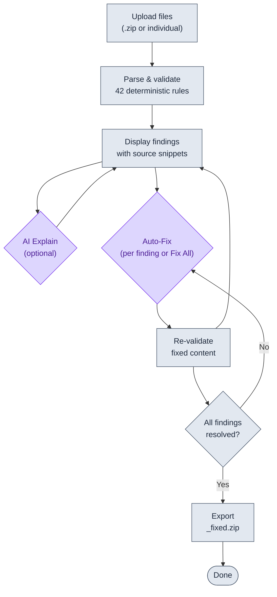

*A mystical code review tool for Workday Extend applications.*

> ⚗️ **Validate. Visualize. Improve.** — PMD, Pod, and Script compliance with wizard-level precision.


[](https://github.com/Developers-and-Dragons/ArcaneAuditor/releases)

---

## 🎯 Overview

Arcane Auditor channels ancient wisdom through **42 comprehensive validation rules** to reveal hidden quality issues that compilers cannot detect but master code wizards should catch. This mystical tool analyzes:

- **📄 PMD Files**: Page definitions with embedded scripts, endpoints, and presentation layers
- **🧩 Pod Files**: Reusable components with template widgets and endpoint configurations
- **📜 Script Files**: Standalone .script files with function libraries and utilities
- **📋 AMD Files**: Application manifest definitions
- **📋 SMD Files**: Security manifest definitions

---

## 🌟 What Makes Arcane Auditor Special?

### 🧙 **Always Ready Reviewer**
Like having an experienced Extend developer over your shoulder. No more wondering if you're following the style guide!

### 🔍 **True Script Understanding**
Actually parses PMD Script to analyze complexity and quality—not just text matching.

### 🎯 **Exact Line Numbers**
Violations are reported according to the exact line in your source files - no more hunting through hundreds of lines of code.

### 🧠 **Smart Analysis**
- **42 comprehensive rules** covering script quality and structural issues
- **Intelligent function tracking** - knows when functions are called across sections
- **Cross-field analysis** - detects issues that span multiple script blocks
- **Context-aware validation** - understands PMD/Pod/Script/AMD/SMD relationships

### 🛡️ **Update-Safe Configuration**
Layered config system protects your customizations during updates. Your personal and team configs are never overwritten.

### 📊 **Multiple Output Formats**
- **Console**: Quick feedback during development
- **Excel**: Detailed reports with context sheets for stakeholder review
- **JSON**: Optimal for CI system or ingestion by external tools
- **Web Interface**: Visual analysis with drag-and-drop convenience

---

## 📋 Prerequisites

### **UV Package Manager** ⭐

**UV is the fastest and easiest way to get started!**

- **Automatically downloads Python** - no separate installation needed
- **10-100x faster** than pip
- **Install UV:**
  - **Windows:** `powershell -c "irm https://astral.sh/uv/install.ps1 | iex"`
  - **macOS/Linux:** `curl -LsSf https://astral.sh/uv/install.sh | sh`
  - **More options:** [UV Installation Guide](https://docs.astral.sh/uv/getting-started/installation/)
- **Verify:** `uv --version`

> 💡 **That's all you need!** UV handles Python installation automatically when you run the tool.
>
> 🔧 **Advanced users:** If you cannot use UV, see [Alternative Installation Methods](#-alternative-installation-methods) for pip instructions.

---

## ⚡ Quick Start Guide

### Installation
1. **Download** the [latest release](https://github.com/Developers-and-Dragons/ArcaneAuditor/releases)
1. **Extract** to your desired location
1. **Install dependencies** (first time only):
   ```bash
   cd ArcaneAuditor
   uv sync
   ```

### 🤔 Which Interface Should I Use?

| Use Case | Best Choice | Why? |
|----------|-------------|------|
| **First-time users** | 🌐 Web Interface | Visual, intuitive, no commands to remember |
| **Quick analysis** | 🌐 Web Interface | Drag & drop, instant results |
| **CI/CD pipelines** | ⚔️ Command Line | Scriptable, exit codes, automation-friendly |
| **Batch processing** | ⚔️ Command Line | Process multiple archives efficiently |
| **Custom workflows** | ⚔️ Command Line | Full control over configuration and output |

---

### 🌐 Option 1: Web Interface (Recommended for Most Users)

1. **Run** the startup script:
   ```bash
   cd ArcaneAuditor

   # Windows
   start-web-service.bat
   
   # macOS/Linux
   ./start-web-service.sh
   ```
   *The script automatically starts the server, and opens your browser!*

1. **Upload** your application ZIP file or drag & drop individual files
1. **Review** results and download Excel reports


#### Screenshots

**Dark Mode:**


**Light Mode:**


<details>
<summary>📸 More Screenshots</summary>

**Upload View:**


**Issues View:**


**Issues Breakdown:**


**Configuration View:**


</details>

---

### ⚔️ Option 2: Command Line (Power Users & CI)

**Quick commands:**

```bash
cd ArcaneAuditor

# Analyze a complete application
uv run main.py review-app myapp.zip

# Analyze individual files
uv run main.py review-app file1.pmd file2.pod file3.script

# Use specific configuration
uv run main.py review-app myapp.zip --config my-config

# Generate Excel report
uv run main.py review-app myapp.zip --format excel --output report.xlsx
```

> 💡 **No Python installation needed!** UV automatically downloads and manages Python when you run `uv run`.

---

## 📦 Alternative Installation Methods

<details>
<summary>📦 Installation Details (click to expand)</summary>

### Option A: Clone Repository

**Best for:** Contributing or staying on latest development

```bash
# Clone the repository
git clone https://github.com/Developers-and-Dragons/ArcaneAuditor.git
cd ArcaneAuditor

# Install dependencies
uv sync

# Optional: Run tests
uv run pytest
```

### Option B: Traditional pip (macOS/Linux)

**Best for:** Restricted environments without UV

> Requires Python 3.12+ pre-installed

```bash
cd ArcaneAuditor
python3 -m venv .venv
source .venv/bin/activate
pip install -e .

# Run without 'uv run' prefix
python main.py review-app myapp.zip
python web/server.py --port 8080
```

### Option C: Traditional pip (Windows)

**Best for:** Windows machines without UV

> Requires Python 3.12+ -- download from https://www.python.org/downloads/ and check **"Add to PATH"** during install.

```powershell
cd ArcaneAuditor
python -m venv .venv
.venv\Scripts\activate
pip install -e .

# Run without 'uv run' prefix
python main.py review-app myapp.zip
python web/server.py --port 8080
```

> To install UV on Windows instead: `powershell -ExecutionPolicy ByPass -c "irm https://astral.sh/uv/install.ps1 | iex"`

</details>

---

## 🧠 LLM Explain Layer (Optional)

Arcane Auditor includes an optional LLM-powered triage layer (`explain.py`) that takes the deterministic findings and produces a human-friendly summary with prioritized explanations and fix suggestions.

### Setup

```bash
# Install the extra dependency (one time)
uv pip install litellm
```

### Usage

```bash
# Default: uses local Ollama (llama3.2) -- no API key needed
uv run python explain.py myapp.zip

# OpenAI
OPENAI_API_KEY=sk-... uv run python explain.py myapp.zip --model gpt-4o

# Claude
ANTHROPIC_API_KEY=sk-ant-... uv run python explain.py myapp.zip --model anthropic/claude-sonnet-4-6

# Skip the LLM, just get structured JSON output
uv run python explain.py myapp.zip --json-only
```

### Without UV (pip)

```bash
# After activating your venv (see Alternative Installation above)
pip install litellm
python explain.py myapp.zip
```

> The LLM layer is purely additive -- Arcane Auditor's core analysis runs the same 42 deterministic rules regardless. The LLM just explains the results.

### Customizing AI Prompts

The AI behavior is controlled by two plain-text prompt files. Edit them to change tone, add domain-specific guidance, or adjust fix strategies. Changes take effect on the next request — no restart required.

| File | Controls | Purpose |
|------|----------|---------|
| [`prompts/explain_system.md`](prompts/explain_system.md) | AI Explain | How findings are explained and prioritized |
| [`prompts/autofix_system.md`](prompts/autofix_system.md) | Auto-Fix | How the LLM generates corrected files |

---

## 🔄 How It Works

Arcane Auditor separates **what finds issues** from **what fixes them**. The 42 validation rules are fully deterministic — they produce the same results every time, with no AI involved. AI is only used in two optional steps: explaining findings in plain English, and generating code fixes.



| Step | Type | What happens |
|------|------|-------------|
| **Upload** | Deterministic | Files extracted and prepared for analysis |
| **Parse & Validate** | Deterministic | 42 rules run against the code — same input always produces same findings |
| **Display** | Deterministic | Findings shown with source snippets and highlighted lines |
| **AI Explain** | AI (Claude) | Optional — generates plain-English explanations and fix suggestions |
| **Auto-Fix** | AI (Claude) | Sends the file + finding to Claude CLI, receives corrected file back |
| **Re-validate** | Deterministic | Runs the same 42 rules on the fixed file to confirm the fix worked |
| **Export** | Deterministic | Bundles all fixed files into a `_fixed.zip` download |

---

## 🌐 Web Interface

### Features

- **📁 Drag & Drop Upload**: Easy file selection with ZIP or individual files
- **⚙️ Configuration Presets**: Choose from `development` or `production-ready` modes
- **📊 Real-time Results**: Quick analysis with detailed violation reports
- **📥 Excel Export**: Comprehensive reports with context information
- **🌙 Theme Support**: Dark and light modes
- **🤖 AI Auto-Fix**: Per-finding or per-file auto-correction via Claude CLI
- **📦 ZIP Export**: Download all fixed files as a single archive

### Starting the Server

**Quick Launch (Recommended):**

```bash
# Windows - Auto-opens browser
start-web-service.bat

# macOS/Linux - Auto-opens browser
./start-web-service.sh
```

**Custom Options:**

```bash
# Custom port
start-web-service.bat --port 3000

# Specific host (for network access)
./start-web-service.sh --host 0.0.0.0 --port 8080

# Don't auto-open browser
start-web-service.bat --no-browser
```

> 💡 **Tip:** See [WEB_SERVICE_SCRIPTS.md](WEB_SERVICE_SCRIPTS.md) for advanced options.

<details>
<summary>🔗 API Endpoints</summary>

| Endpoint | Method | Description |
|----------|--------|-------------|
| `/` | GET | Main interface |
| `/api/upload` | POST | File upload (ZIP or individual files) |
| `/api/job/{job_id}` | GET | Poll job status |
| `/api/download/{job_id}` | GET | Download Excel report |
| `/api/configs` | GET | Available configurations |
| `/api/explain` | POST | AI-powered finding explanations |
| `/api/autofix` | POST | AI auto-fix for a single finding |
| `/api/revalidate` | POST | Re-run rules on modified files |
| `/api/export-zip` | POST | Bundle fixed files into a ZIP |
| `/api/health` | GET | Health check |

</details>

---

## ⚙️ Configuration

Arcane Auditor uses a **layered configuration system** that protects your customizations:

### Built-in Presets

- **`development`** - Lenient rules for active development
  - Allows console logs, unused code, work-in-progress
  - Perfect for daily coding
- **`production-ready`** - Comprehensive validation for deployment
  - All rules enabled, strict settings
  - Catches everything including cleanup items

### Configuration Priority (Highest to Lowest)

1. **Command Line Arguments**
1. **Personal Configuration** (`config/personal/*.json`) ✅ Update-safe
1. **Team Configuration** (`config/teams/*.json`) ✅ Update-safe
1. **Built-in Presets** (`config/presets/*.json`) ⚠️ Overwritten on app updates - don't modify these!

### Creating Custom Configs

**Generate a baseline:**

```bash
uv run main.py generate-config > config/personal/my-config.json
```

**Example personal config** (`config/personal/my-settings.json`):

```json
{
  "rules": {
    "ScriptConsoleLogRule": {
      "enabled": false
    },
    "ScriptLongBlockRule": {
      "custom_settings": {
        "max_lines": 50,
        "skip_comments": true,
        "skip_blank_lines": true
      }
    }
  }
}
```

**Use custom config:**

```bash
uv run main.py review-app myapp.zip --config my-config
```

> 📖 **Full details:** See [Configuration Guide](config/README.md)

---

## 🔧 Validation Rules

Arcane Auditor enforces **42 validation rules** across 2 categories:

### 📜 Script Rules (23 rules)

**Code Quality:**
- Cyclomatic complexity limits
- Function length restrictions
- Nesting depth checks
- Magic number detection

**Best Practices:**
- Use `let`/`const` instead of `var`
- Array method usage over manual loops
- Template literals over string concatenation
- Descriptive parameter names

**Dead Code Detection:**
- Unused functions (embedded scripts)
- Unused variables
- Dead code (standalone .script files)
- Unused function parameters
- Unused script includes

### 🏗️ Structure Rules (19 rules)

**Widget Validation:**
- Required IDs on widgets
- Naming convention enforcement
- Footer pod structure

**Endpoint Configuration:**
- Error handling (failOnStatusCodes)
- Naming conventions
- Performance patterns (isCollection, bestEffort)

**Security & Hardcoding:**
- Security domain requirements
- Hardcoded WIDs and application IDs
- Workday API URL patterns

**File Organization:**
- File naming conventions
- PMD section ordering
- String interpolator patterns

> 📖 **Complete rule details:** See [Rule Documentation](parser/rules/RULE_BREAKDOWN.md)

---

## 🎓 Learning Game

Master the 42 Arcane Auditor rules through an **interactive quiz game** with real code examples!


### 🎮 Features

- **42 Rules Coverage**: Practice all Script and Structure validation rules
- **Gamified Learning**: Score points, build streaks, earn mastery badges
- **Multiple Difficulty Levels**: Easy (True/False), Medium (Code Identification), Hard (Complex Scenarios)
- **Dark/Light Mode**: Choose your preferred theme
- **Comprehensive Explanations**: Learn why each rule matters with code comparisons
- **Progress Tracking**: Monitor which rules you've mastered
- **No Installation Required**: Pure HTML/CSS/JavaScript - just open in your browser!

### 🚀 Quick Start

```bash
# Open the game
open arcane-learning-game/index.html

# Or just double-click index.html in your file browser
```

The game helps you learn Workday Extend best practices through hands-on quizzes with real violation and fix examples from the rule documentation.

> 📖 **More details:** See [Learning Game Guide](arcane-learning-game/README.md) | [Quick Start](arcane-learning-game/QUICK_START.md)

---

## 🚀 Advanced Usage

<details>
<summary>🤖 CI/CD Integration</summary>

### Exit Codes

| Code | Meaning | Use Case |
|------|---------|----------|
| **0** | ✅ Success | Clean code, or ADVICE issues only |
| **1** | ⚠️ Quality Issues | ACTION issues found |
| **2** | ❌ Usage Error | Invalid config/files |
| **3** | 💥 Runtime Error | Analysis failed |

### Pipeline Examples

```bash
# Standard: Fail on ACTION issues only
uv run main.py review-app myapp.zip --format json --output report.json
if [ $? -eq 1 ]; then
    echo "❌ Code quality issues - review required"
    exit 1
fi

# Strict: Fail on both ACTION and ADVICE
uv run main.py review-app myapp.zip --fail-on-advice --quiet

# Check exit code programmatically
uv run main.py review-app myapp.zip
case $? in
    0) echo "✅ Clean" ;;
    1) echo "⚠️ Issues found" ;;
    2) echo "❌ Tool misconfigured" ;;
    3) echo "💥 Analysis failed" ;;
esac
```

### CI Flags

- `--fail-on-advice` - Fail on ADVICE issues (stricter)
- `--quiet` - Minimal output for logs
- `--format json --output report.json` - Machine-readable output for tooling
- `--format excel --output report.xlsx` - Human-readable reports for review

</details>

<details>
<summary>🧠 Context Awareness</summary>

Arcane Auditor provides **intelligent context awareness**:

### Complete Analysis ✅

When all files are provided (PMD, AMD, SMD), runs **all enabled rules**.

### Partial Analysis ⚠️

When files of certain types are missing:
- Runs available rules on provided files
- Indicates which files are missing
- Shows which rules couldn't execute
- Provides guidance for complete validation

### Supported Modes

```bash
# ZIP analysis (complete)
uv run main.py review-app myapp.zip

# Individual files (partial)
uv run main.py review-app mypage.pmd

# Multiple files
uv run main.py review-app file1.pmd file2.pod file3.script
```

> 💡 The tool clearly shows analysis completeness in all output formats.

</details>

---

## 🛠️ Development

<details>
<summary>🛠️ Contributing & Development Setup</summary>

### Quick Setup

```bash
# Clone repository
git clone https://github.com/Developers-and-Dragons/ArcaneAuditor.git
cd ArcaneAuditor

# Install dependencies
uv sync

# Run tests
uv run pytest
```

### Project Structure

```
web/              → Web interface (FastAPI + frontend)
tests/            → Automated test suite
config/           → Presets, team, and personal configs
docs/             → Documentation
parser/rules/     → Validation rules
  ├── script/     → Script quality rules
  ├── structure/  → Structure validation rules
  └── custom/     → Custom rule support
```

## 🤝 Contributing

Contributions are welcome! Please submit pull requests against the `develop` branch.

➡️ **See full guidelines here:** [CONTRIBUTING.md](CONTRIBUTING.md)


### Custom Rules

Create custom rules in `parser/rules/custom/user/`:

```python
from parser.rules.base import Rule, Finding
from parser.models import ProjectContext
from typing import Generator

class MyCustomRule(Rule):
    ID = "CUSTOM001"
    DESCRIPTION = "My organization-specific rule"
    SEVERITY = "ADVICE"
    
    def analyze(self, context: ProjectContext) -> Generator[Finding, None, None]:
        # Your validation logic
        pass
```

> 📖 **Full guide:** See [Custom Rules Guide](parser/rules/custom/README.md)

</details>

---

## 📚 Documentation

- **[Rule Documentation](parser/rules/RULE_BREAKDOWN.md)** - All 42 rules with examples
- **[Configuration Guide](config/README.md)** - Configuration options and presets
- **[Custom Rules Guide](parser/rules/custom/README.md)** - Create your own rules
- **[Web Service Scripts](WEB_SERVICE_SCRIPTS.md)** - Startup script documentation

---

## 📄 License

This project is licensed under the MIT License - see the [LICENSE](LICENSE) file for details.

---

⭐ **If Arcane Auditor helps you, star the repo and share the magic!**

*May the Weave guide your code to perfection!* ✨
