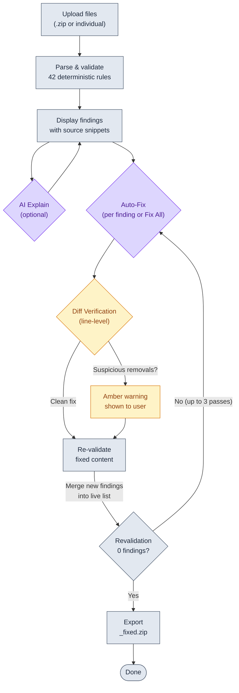
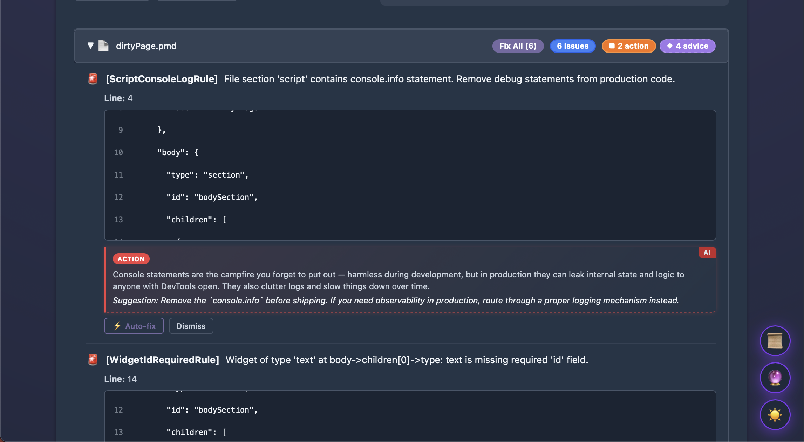
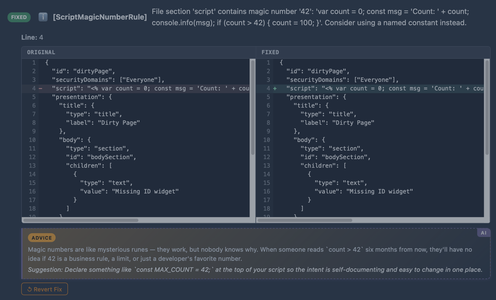
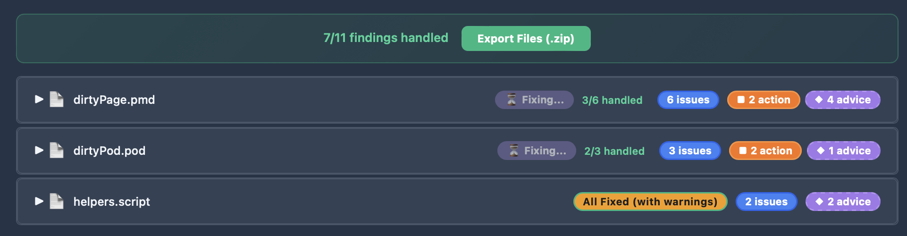
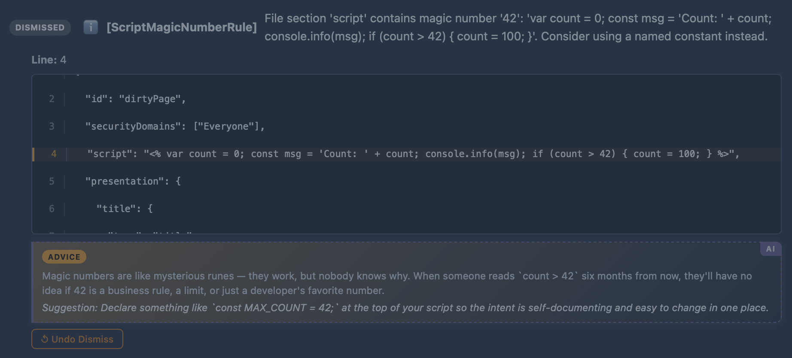

*A mystical code review tool for Workday Extend applications.*

> ⚗️ **Validate. Visualize. Improve.** — PMD, Pod, and Script compliance with wizard-level precision.


[](https://github.com/Developers-and-Dragons/ArcaneAuditor/releases)
[](https://buymeacoffee.com/developersanddragons)

---

## ✨ Overview

Arcane Auditor channels ancient wisdom through **42 validation rules** to reveal subtle code quality issues invisible to compilers but obvious to master developers.

It analyzes:

- **📄 PMD** — Page definitions with embedded scripts and endpoints
- **🧩 Pod** — Reusable widget components
- **📜 Script** — Function libraries and utilities
- **🗝️ AMD / 🔒 SMD** — Application and security manifests

**Key Traits**

- 🧙 Always-ready reviewer that understands Extend best practices
- 🔍 Precise line-level detection
- 🧠 Context-aware validation (cross-file and cross-field)
- ⚙️ Update-safe configuration layering
- 📊 Multiple output formats: Excel (desktop UI and CLI), JSON (CLI only)

---

## 🚀 Quick Start — Desktop App

**New in v1.4:** Arcane Auditor now supports managing rule configurations, right in the app UI! Create new configs, enable/disable rules, and change severities.
In addition, you can also now browse the rules grimoire, right from the UI!

### 1. Download

Get the latest build from [GitHub Releases](https://github.com/Developers-and-Dragons/ArcaneAuditor/releases):

| Platform                      | File                                | Description                                                        |
| ----------------------------- | ----------------------------------- | ------------------------------------------------------------------ |
| 🪟**Windows (Desktop)** | `ArcaneAuditor.exe`               | Full desktop app — double-click to launch                         |
| 🍎**macOS (Desktop)**   | `ArcaneAuditor_macOS_Desktop.dmg` | Double click DMG, drag **Arcane Auditor.app** to Applications |
| ⚙️**Windows (CLI)**   | `ArcaneAuditorCLI.exe`            | Command-line analyzer for automation and CI/CD                     |
| ⚙️**macOS (CLI)**     | `ArcaneAuditor_macOS_CLI.zip`     | Unzip and run `ArcaneAuditorCLI` from Terminal                   |

> 🧩 **Note for macOS users:**
> The first time you open the app or CLI, macOS Gatekeeper may show
> “App is from an unidentified developer.”
> Right-click → **Open** once to approve; future launches will be trusted.

### 2. Install & Run

**Windows**

1. Download `ArcaneAuditor.exe`
2. Double-click to launch (no installation required)

**macOS**

1. Open `ArcaneAuditor_macOS_Desktop.dmg`
2. Drag **Arcane Auditor.app** to Applications
3. Open from Launchpad or Finder

### 3. Analyze

Drag and drop your Extend app ZIP or individual files (`.pmd`, `.pod`, `.script`, `.amd`, `.smd`).
Results appear faster than a polymorph spell — download Excel reports as needed.

**Includes:** 42 rules, configuration presets, Excel export — fully self-contained.

> 💡 **Windows SmartScreen Notice**
> Even with code signing, Windows SmartScreen may show “Windows protected your PC” until the app builds download reputation with Microsoft.
> This is normal for new/updated releases. Click **More info** → **Run anyway** to proceed.
> The warning will disappear as more users successfully run the signed app.

---

## 🧩 Interfaces at a Glance

| Interface             | Best For             | Launch                                    | Highlights                             |
| --------------------- | -------------------- | ----------------------------------------- | -------------------------------------- |
| 🖥️**Desktop** | Everyone             | Native app                                | Clean UI, drag-and-drop, fast analysis |
| ⚔️**CLI**     | CI/CD and automation | `ArcaneAuditorCLI review-app myapp.zip` | Scriptable, Excel/JSON output          |

<details>
<summary>📸 Screenshots</summary>

**Dark Mode:**


**Light Mode:**


**Issues View:**


**Issues Breakdown:**


</details>

---

## ⚔️ Command Line Interface

For automation, CI/CD pipelines, and power users who prefer the terminal:

**Download:**

- **Windows:** `ArcaneAuditorCLI.exe`
- **macOS:** `ArcaneAuditor_macOS_CLI.zip` (unzip to get `ArcaneAuditorCLI`)

**Usage:**

```bash
# Analyze an app
ArcaneAuditorCLI review-app myapp.zip

# Use custom configuration
ArcaneAuditorCLI review-app myapp.zip --config production-ready

# Export to Excel
ArcaneAuditorCLI review-app myapp.zip --format excel --output report.xlsx

# Export to JSON for CI/CD
ArcaneAuditorCLI review-app myapp.zip --format json --output report.json
```

**Exit Codes for CI/CD:**

| Exit Code   | Meaning           | Use Case              |
| ----------- | ----------------- | --------------------- |
| **0** | ✅ Clean          | No ACTION issues      |
| **1** | ⚠️ Issues Found | ACTION issues present |
| **2** | ❌ Usage Error    | Invalid files/config  |
| **3** | 💥 Runtime Error  | Analysis failure      |

---

## ⚙️ Configuration

Arcane Auditor uses a **layered, update-safe configuration** system:

1. **Built-in Presets**
   - `development` — lenient, allows console logs / work-in-progress code
   - `production-ready` — strict, deployment-grade validation
2. **Team Configuration**
   - Windows: `%AppData%\ArcaneAuditor\config\rules\teams\`
   - macOS: `~/Library/Application Support/ArcaneAuditor/config/rules/teams/`
3. **Personal Configuration**
   - Windows: `%AppData%\ArcaneAuditor\config\rules\personal\`
   - macOS: `~/Library/Application Support/ArcaneAuditor/config/rules/personal/`
4. **Command-line overrides** (highest priority)

**Example personal config:**

```json
{
  "rules": {
    "ScriptConsoleLogRule": { "enabled": false },
    "ScriptLongBlockRule": {
      "custom_settings": { "max_lines": 50, "skip_comments": true }
    }
  }
}
```

Use via CLI:

```bash
ArcaneAuditorCLI review-app myapp.zip --config my-config
```

> 📖 Full reference: [Configuration Guide](docs/CONFIGURATION.md)

---

## 🧠 Validation Rules

Arcane Auditor enforces **42 rules** across two realms:

### 📜 Script Quality (23)

Complexity limits • long-function checks • unused variables/functions • naming • magic numbers • descriptive parameters

### 🗝️ Structural Integrity (19)

Widget IDs • endpoint failOnStatusCodes • naming conventions • file structure • security domain checks

> 📖 See full details: [Rule Documentation](docs/RULES.md)

---

## 🤖 AI Features (Fork Addition)

This fork adds an optional AI layer on top of the deterministic engine — **AI Explain** and **AI Auto-Fix** — powered by Anthropic's Claude API.

### The Deterministic Sandwich

> **Deterministic rules find the issues. AI explains and fixes them. Deterministic rules verify the fix.**

The AI autofix receives the *deterministic finding* directly (rule ID, severity, line number, message) — never the AI-generated explanation. After every fix, a line-level diff checks for suspicious removals, and then the same 42 rules re-run on the modified code. Export is gated on revalidation returning zero findings, not on the AI's self-assessment.



| Step | Type | What happens |
|------|------|-------------|
| **Upload** | Deterministic | Files extracted and prepared for analysis |
| **Parse & Validate** | Deterministic | 42 rules run against the code — same input always produces same findings |
| **Display** | Deterministic | Findings shown with source snippets and highlighted lines |
| **AI Explain** | AI (optional) | Generates plain-English explanations and fix suggestions |
| **Auto-Fix** | AI (temp 0) | Receives the deterministic finding + full file. Returns corrected file |
| **Diff Verification** | Deterministic | Line-level diff flags suspicious removals |
| **Re-validate** | Deterministic | Runs the same 42 rules on the fixed file |
| **Fix All** | AI + Deterministic | Additive fixes first, removals last, up to 3 convergence passes |
| **Export** | Deterministic | Bundles all fixed files into `_fixed.zip` — only after revalidation passes |

### See It in Action

<details>
<summary>📸 AI Features Gallery</summary>

**AI Explanations & Auto-Fix Buttons**
Each finding gets an AI-generated explanation with priority, plus one-click Auto-Fix and Dismiss controls.


**Side-by-Side Diff View**
After auto-fixing, a GitHub-style split diff shows exactly what changed — Original on the left, Fixed on the right.


**Fix All in Bulk**
Fix every issue across all files at once. Progress tracks each file group with pass/fail status.


**Dismiss Findings**
Mark findings as intentional. Dismissed findings stay visible with their AI explanation for reference.


**Export Fixed Files**
Download all fixed files as a single `_reviewed.zip` archive, gated on revalidation passing.


**Loading Animations**
Thematic loading states while the engine works its magic.


</details>

### Customizing AI Prompts

| File | Controls | Purpose |
|------|----------|---------|
| [`prompts/explain_system.md`](prompts/explain_system.md) | AI Explain | How findings are explained and prioritized |
| [`prompts/autofix_system.md`](prompts/autofix_system.md) | Auto-Fix | How the LLM generates corrected files |

Prompts are hot-reloaded (mtime-cached) — edit and see changes on the next request without restarting.

### Required Environment

- `ANTHROPIC_API_KEY` — required for AI explain and autofix
- `LLM_MODEL` — model override (default: `claude-sonnet-4-6`)

---

## 🐳 Docker Deployment (Fork Addition)

```bash
# Build and run
docker compose build --no-cache
docker compose up -d

# Check logs
docker logs arcane-auditor --tail 20
```

Create a `.env` file with:

```
ANTHROPIC_API_KEY=sk-ant-...
```

The service runs on port 8080 internally, mapped to 8082 externally. Prompts are mounted read-only for hot-reload without rebuild.

---

## ⚡ Advanced Usage

<details>
<summary>🧩 Context Awareness</summary>

Arcane Auditor detects missing files and adjusts validation scope automatically:

- **Complete** when PMD + AMD + SMD provided
- **Partial** when some missing (rules skipped with clear indicators)
- Reports list skipped or partial rules and suggest required files.

</details>

<details>
<summary>🔧 Port Configuration (Desktop App)</summary>

The desktop app runs a local server (default port 8080).
If you have a port conflict, edit:

**Windows:** `%AppData%\ArcaneAuditor\config\web\web_service_config.json`
**macOS:** `~/Library/Application Support/ArcaneAuditor/config/web/web_service_config.json`

```json
{
  "host": "127.0.0.1",
  "port": 8081,
  "log_level": "info"
}
```

</details>

---

## 🧑‍💻 Developer Installation (Optional)

For those extending Arcane Auditor or building from source:

```bash
# Clone and install dependencies
git clone https://github.com/Developers-and-Dragons/ArcaneAuditor.git
cd ArcaneAuditor
uv sync
```

**UV** automatically installs and manages Python (tested with **Python 3.12.6**) — no manual setup required.More details: [UV Installation Guide](https://docs.astral.sh/uv/getting-started/installation/)

> 📖 For development setup, building executables, and contributing guidelines, see [CONTRIBUTING.md](CONTRIBUTING.md)

---

## 🧙 Contributing

Contributions are welcome! Submit pull requests against the **`develop`** branch.

> 📖 See [CONTRIBUTING.md](CONTRIBUTING.md) and [Custom Rules Guide](docs/CUSTOM_RULES.md)

---

## 📚 Documentation

- [Rule Documentation](docs/RULES.md)
- [Configuration Guide](docs/CONFIGURATION.md)
- [Custom Rules Guide](docs/CUSTOM_RULES.md)

---

## 📄 License

Licensed under the **MIT License** — see [LICENSE](LICENSE).

---

⭐ **If Arcane Auditor helps you, star the repo and share the magic!**
⚡ **Channel mana to the developer:** [Support the Weave](https://buymeacoffee.com/developersanddragons)
*May the Weave guide your code to perfection.* ✨
