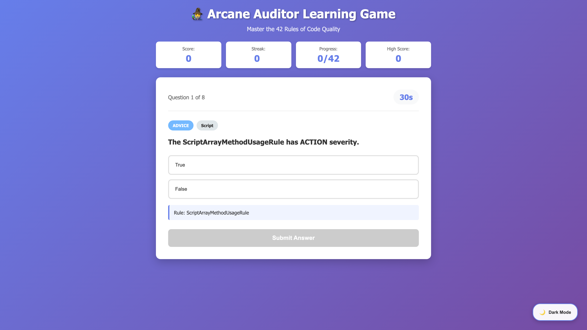
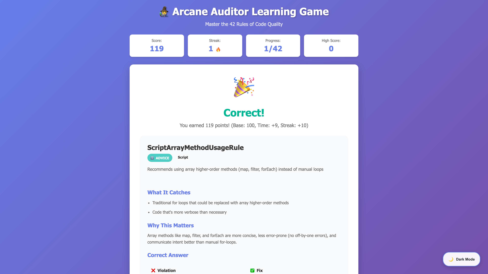
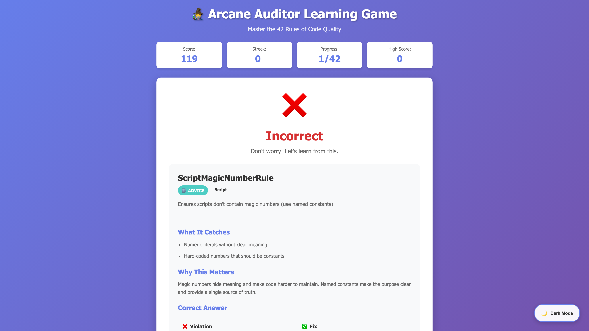

# 🧙‍♂️ Arcane Auditor Learning Game

An interactive, gamified learning experience to master all 42 ArcaneAuditor code quality rules through engaging quizzes and real code examples.


## 🎮 Features

### Interactive Learning
- **42 Rules Coverage**: Learn all ArcaneAuditor rules across Script and Structure categories
- **Real Code Examples**: Practice with actual violation and fix examples from the documentation
- **Multiple Question Types**: True/False, Multiple Choice, Code Identification, and more
- **Difficulty Levels**: Easy, Medium, and Hard modes to match your skill level

### Gamification
- **Score System**: Earn points for correct answers with time and streak bonuses
- **Streak Tracking**: Build up streaks for consecutive correct answers with fire indicators 🔥
- **Progress Tracking**: Monitor which rules you've mastered (tracked out of 42 total)
- **High Score**: Beat your personal best and track improvement over time
- **Mastery Levels**: Achieve ranks from Novice Learner to Master Wizard based on accuracy

### Quiz Modes
- **Category Selection**:
  - Script Rules (23 rules)
  - Structure Rules (19 rules)
  - All Rules (42 rules)
- **Adaptive Difficulty**:
  - **Easy**: True/False and basic multiple choice questions
  - **Medium**: Code example identification
  - **Hard**: Complex scenarios and code comparisons

### Learning Features
- **Detailed Explanations**: See why each rule matters after every question
- **Code Comparisons**: View violation vs. fix side-by-side
- **Rule Information**: Display severity (ACTION 🚨 vs ADVICE ℹ️) and category
- **Timer Challenges**: 30-second timer per question for focused learning

## 🚀 Getting Started

### Prerequisites
- Any modern web browser (Chrome, Firefox, Safari, Edge)
- No server or installation required!

### Running the Game

1. **Clone or Download** the game files
2. **Open** `index.html` in your web browser
3. **Start Playing** - Choose your category and difficulty, then begin learning!

That's it! The game runs entirely in your browser with no dependencies.

## 📸 Screenshots

### Main Menu
Choose your category and difficulty to start your learning journey:


### Gameplay
Test your knowledge with interactive questions and code examples:



### Learning from Results

**Correct Answer:**

When you get it right, see detailed explanations of why the rule matters:



**Learning from Mistakes:**

When you get it wrong, learn from comprehensive feedback with code comparisons:



## 📖 How to Play

### Step 1: Choose Your Challenge
1. Select a **category**:
   - 📜 Script Rules (code quality best practices)
   - 🏗️ Structure Rules (configuration and structural compliance)
   - ⚡ All Rules (comprehensive challenge)

2. Select a **difficulty**:
   - **Easy**: Great for first-time learners
   - **Medium**: Test your code recognition skills
   - **Hard**: Master-level challenges

### Step 2: Answer Questions
- Read each question carefully
- Review code examples when provided
- Select your answer before the 30-second timer runs out
- Submit to see if you're correct

### Step 3: Learn and Improve
- After each answer, review the explanation
- See why the rule matters
- Compare violation vs. fix code examples
- Build your knowledge progressively

### Step 4: Track Your Progress
- Monitor your current score and streak
- Track rules you've mastered (out of 42)
- See your accuracy and best streak
- Aim for Master Wizard status (90%+ accuracy)

## 🎯 Scoring System

### Base Points
- **100 points** per correct answer

### Bonuses
- **Time Bonus**: Up to +10 points for quick answers (timeRemaining / 3)
- **Streak Bonus**: +10 points per question in your streak
  - 1 answer streak: 🔥
  - 3 answer streak: 🔥🔥
  - 5+ answer streak: 🔥🔥🔥

### Example
Answer in 27 seconds with a 3-question streak:
- Base: 100 points
- Time Bonus: +9 points (27/3)
- Streak Bonus: +30 points (3 * 10)
- **Total: 139 points**

## 🏆 Mastery Levels

| Accuracy | Rank | Badge |
|----------|------|-------|
| 90%+ | Master Wizard | 🧙‍♂️✨ |
| 75-89% | Adept Sorcerer | 🔮 |
| 60-74% | Apprentice Mage | 📚 |
| <60% | Novice Learner | 🎓 |

## 📚 What You'll Learn

### Script Rules (23 Rules)
Code quality and best practices including:
- Variable declarations and naming
- Function complexity and length
- Array method usage and performance
- Dead code detection
- Console log usage
- Magic numbers and constants
- And more!

### Structure Rules (19 Rules)
Configuration and structural compliance including:
- Endpoint configuration
- Widget requirements
- Security domains
- File naming conventions
- Hardcoded values detection
- PMD structure organization
- And more!

## 💾 Data Persistence

The game uses browser localStorage to save:
- **High Score**: Your best score across all sessions
- Automatically loads when you return
- No account or sign-up required

## 🛠️ Technical Details

### Built With
- **HTML5**: Semantic structure
- **CSS3**: Modern responsive design with gradients and animations
- **Vanilla JavaScript**: No frameworks or dependencies
- **LocalStorage API**: Client-side data persistence

### Browser Compatibility
- ✅ Chrome 90+
- ✅ Firefox 88+
- ✅ Safari 14+
- ✅ Edge 90+

### File Structure
```
arcane-learning-game/
├── index.html              # Main game interface
├── css/
│   └── styles.css          # All styling and animations
├── js/
│   └── game.js             # Game logic and mechanics
├── data/
│   └── rules-data.js       # 42 rules with examples and explanations
└── README.md               # This file
```

## 🎨 Features Breakdown

### Question Types
1. **True/False**: Test rule severity and category knowledge
2. **Why Matters**: Understanding the purpose of each rule
3. **Severity Check**: Identify ACTION vs ADVICE rules
4. **Identify Violation**: Spot problematic code
5. **Identify Fix**: Choose the correct solution
6. **Code Comparison**: Match violations to rules
7. **Multiple Rules**: What does this rule catch?

### UI/UX Highlights
- **Responsive Design**: Works on desktop, tablet, and mobile
- **Smooth Animations**: Fade-ins, hover effects, and transitions
- **Color-Coded Badges**: Visual severity and category indicators
- **Code Syntax**: Monospace font with dark theme for code blocks
- **Progress Feedback**: Real-time score, streak, and progress updates

## 🔄 Game Flow

```
Main Menu → Quiz Screen → Result Screen → Next Question
     ↓           ↓             ↓              ↓
  Category   30s Timer    Explanation    Repeat x10
  Difficulty  Selection   Code Compare        ↓
                                        Final Score
                                             ↓
                                       Mastery Level
```

## 🎓 Learning Tips

1. **Start with Easy Mode**: Build familiarity with rule names and severities
2. **Focus on Categories**: Master Script or Structure rules separately first
3. **Read Explanations**: Don't skip the "Why This Matters" section
4. **Study Code Examples**: Compare violations and fixes carefully
5. **Practice Streaks**: Aim for 5+ question streaks to maximize points
6. **Review Mistakes**: Failed questions teach the most - read why!

## 🌟 Future Enhancements

Potential features for future versions:
- [ ] Custom quiz length (5, 10, 20, or 42 questions)
- [ ] Rule-specific deep dives
- [ ] Detailed progress analytics per rule
- [ ] Leaderboard for multiple users
- [ ] Timed challenge modes
- [ ] Practice mode (no timer, no scores)
- [ ] Export progress reports

## 📝 Data Source

All rule data is sourced from the official [ArcaneAuditor RULE_BREAKDOWN.md](https://github.com/snedea/ArcaneAuditor/blob/main/parser/rules/RULE_BREAKDOWN.md) documentation, ensuring accuracy and alignment with the actual linter rules.

## 🤝 Contributing

Found a bug or have a suggestion? This game is part of the ArcaneAuditor project. Please refer to the main repository for contribution guidelines.

## 📄 License

This learning game is part of the ArcaneAuditor project. See the main repository for license information.

## 🎮 Ready to Play?

Open `index.html` in your browser and start mastering the 42 Arcane Auditor rules!

**Good luck, and may your code be ever clean! 🧙‍♂️✨**
